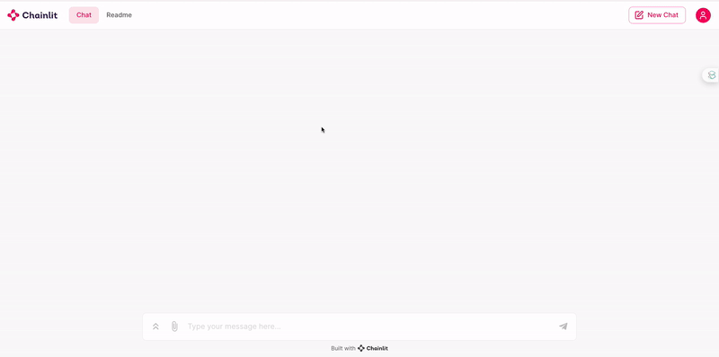

## Calendly Chatbot
This is a Chainlit and OpenAI based conversational chatbot application to interact with Calendly APIs  
Inernally it uses gpt-3.5-turbo as the llm leveraging Openai's Function Calling feature

### Notes on usage
- This application is temporarily hosted => [here](https://036a-67-186-191-156.ngrok-free.app) <=
- The test user has been setup with some already populated examples (you can also use your own calendly token)
- Currently this integrates just `list-events` and `cancel-events` functionalities using Calendly APIs
- Here are few examples to try:
    - `show me scheduled events`
    - `show me events on March 14th`
    - `cancel this event`
    - `cancel event at 5PM on 12th March`

### How to setup this project locally
- `pip install -r requirements.txt`
- Set following environment variables in `.env`  
    `CALENDLY_TEST_TOKEN`, 
    `CALENDLY_TEST_USERID`, 
    `OPENAI_API_KEY`
- Run chainlit using `chainlit run app.py -w` from inside chainlit_app directory

